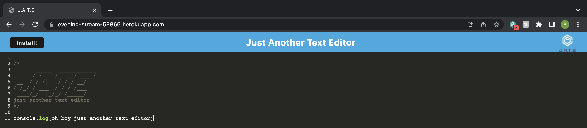
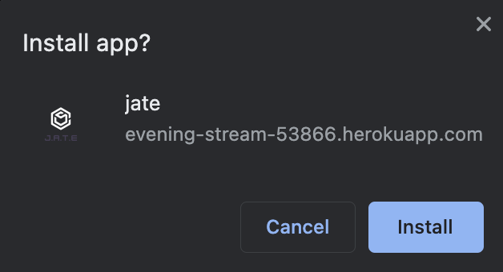
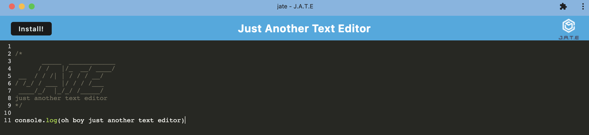

# pwa-text-editor
An app to create notes or code snippets with or without an internet connection

## Description

This project uses npm, webpack, express, concurrently, and other dependencies to create a progressive web application text editor, JATE (just another text editor). This is done witht the help of service workers, caching static assets, manifests, and Heroku deployment. All content typed into JATE is saved to the indexedDB and available upon later use. Furthermore, this app is available for download, allowing JATE to be used in the absence of an internet connection. Creating this project as a progressive web app allows for a more efficient process as PWAs can render a website on the server, cache its contents, and then update the rendering on the client-side only when needed.

<!-- Provide a short description explaining the what, why, and how of your project. Use the following questions as a guide:

- What was your motivation?
- Why did you build this project? (Note: the answer is not "Because it was a homework assignment.")
- What problem does it solve?
- What did you learn? -->

## Table of Contents (Optional)

<!-- If your README is long, add a table of contents to make it easy for users to find what they need. -->

- [Installation](#installation)
- [Usage](#usage)
- [Credits](#credits)
- [License](#license)
- [Badges](#badges)
- [Features](#features)
- [Tests](#tests)

## Installation

There are no modules required for installation. Simply open the [site](https://evening-stream-53866.herokuapp.com) in your preferred browser and begin taking some notes!
<!-- What are the steps required to install your project? Provide a step-by-step description of how to get the development environment running. -->

## Credits

This webpage was built using UW Trilogy Bootcamp class materials as references.

## License

MIT License

Copyright (c) 2022 abbeydoyle

Permission is hereby granted, free of charge, to any person obtaining a copy of this software and associated documentation files (the "Software"), to deal in the Software without restriction, including without limitation the rights to use, copy, modify, merge, publish, distribute, sublicense, and/or sell copies of the Software, and to permit persons to whom the Software is furnished to do so, subject to the following conditions:

The above copyright notice and this permission notice shall be included in all copies or substantial portions of the Software.

THE SOFTWARE IS PROVIDED "AS IS", WITHOUT WARRANTY OF ANY KIND, EXPRESS OR IMPLIED, INCLUDING BUT NOT LIMITED TO THE WARRANTIES OF MERCHANTABILITY, FITNESS FOR A PARTICULAR PURPOSE AND NONINFRINGEMENT. IN NO EVENT SHALL THE AUTHORS OR COPYRIGHT HOLDERS BE LIABLE FOR ANY CLAIM, DAMAGES OR OTHER LIABILITY, WHETHER IN AN ACTION OF CONTRACT, TORT OR OTHERWISE, ARISING FROM, OUT OF OR IN CONNECTION WITH THE SOFTWARE OR THE USE OR OTHER DEALINGS IN THE SOFTWARE.

<!-- The last section of a high-quality README file is the license. This lets other developers know what they can and cannot do with your project. If you need help choosing a license, refer to [https://choosealicense.com/](https://choosealicense.com/). -->

---

<!-- 🏆 The previous sections are the bare minimum, and your project will ultimately determine the content of this document. You might also want to consider adding the following sections. -->

## Badges

<!-- 

Badges aren't necessary, per se, but they demonstrate street cred. Badges let other developers know that you know what you're doing. Check out the badges hosted by [shields.io](https://shields.io/). You may not understand what they all represent now, but you will in time. -->

## Features

This page features:

- Persistent data
- Installable app
- Cached data
- Full PWA capabilities

<!-- If your project has a lot of features, list them here. -->

<!-- ## How to Contribute

If you created an application or package and would like other developers to contribute it, you can include guidelines for how to do so. The [Contributor Covenant](https://www.contributor-covenant.org/) is an industry standard, but you can always write your own if you'd prefer. -->

## Tests

- Take notes, close the window, and reopen the application to see your notes have persisted
- Install the application for use offline 
- After installing JATE, note that all notes taken on the web browser have persisted
<!-- Go the extra mile and write tests for your application. Then provide examples on how to run them here. -->